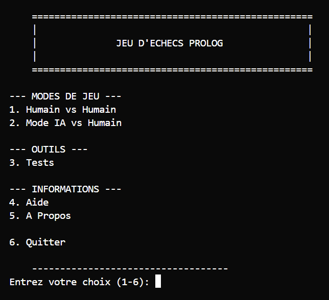
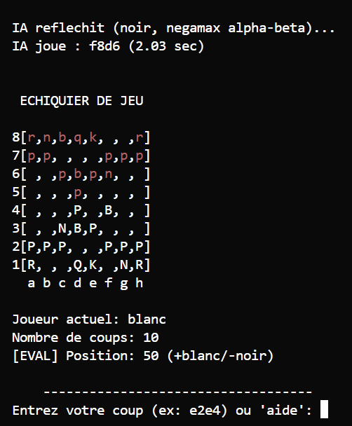
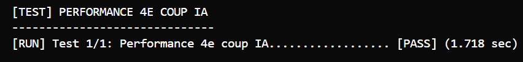

<div align="center">

# 🤖 Prolog Chess AI

**Joueur intelligent d'échecs avec techniques de recherche heuristique**

*Projet IFT-2003 · Intelligence Artificielle · Université Laval*

[](https://www.swi-prolog.org/)
[]()
[]()



*Interface française professionnelle avec modes de jeu et outils intégrés*

</div>

---

## 🚀 Installation & Lancement

```bash
# Démarrer le jeu d'échecs
swipl go.pl
```

<div align="center">
  
  <p><em>IA Négamax Alpha-Beta en action : évaluation temps réel (+50 points blanc) avec plateau ASCII</em></p>
</div>

## 🏗️ Architecture

<table>
<tr><td><strong>Module</strong></td><td><strong>Responsabilité</strong></td></tr>
<tr><td><code>pieces.pl</code></td><td>♟️ Règles de mouvement des pièces</td></tr>
<tr><td><code>board.pl</code></td><td>🏁 Représentation plateau 8×8, affichage ASCII</td></tr>
<tr><td><code>game.pl</code></td><td>⚖️ Gestion états, validation coups, échec/mat/pat</td></tr>
<tr><td><code>interface.pl</code></td><td>🖥️ Interface utilisateur</td></tr>
<tr><td><code>ai.pl</code></td><td>🧠 Algorithme négamax avec élagage alpha-beta</td></tr>
<tr><td><code>evaluation.pl</code></td><td>🎯 Heuristiques de recherche (matériel + PSQT + sécurité)</td></tr>
<tr><td><code>utils.pl</code></td><td>🔧 Constantes globales et helpers partagés</td></tr>
</table>

## ✨ Fonctionnalités

### 🏆 Jeu d'Échecs Standard
- ✅ **Toutes les pièces** et règles officielles FIDE
- ✅ **Détection complète** échec, mat et pat

### 🤖 Intelligence Artificielle

<div align="center">
  
  <p><em>Performance validée : 1.718 secondes pour analyse complète (profondeur 2)</em></p>
</div>

| Composante | Description | Performance |
|------------|-------------|-------------|
| **Algorithme** | Négamax¹ + élagage Alpha-Beta² | Profondeur 2 |
| **Heuristiques** | Matériel + PSQT³ + sécurité pièces | 6 fonctions d'évaluation |
| **Tri des coups** | MVV-LVA⁴ (Most Valuable Victim) | Élagage ~90% |
| **Temps de réponse** | Temps réel | < 3 secondes/coup |

**Références techniques :**
- ¹ Négamax : [Chess Programming Wiki](https://www.chessprogramming.org/Negamax) • [Lichess GitHub](https://github.com/lichess-org/lila)
- ² Alpha-Beta : [Chess Programming Wiki](https://www.chessprogramming.org/Alpha-Beta)
- ³ PSQT : [Chess Programming Wiki](https://www.chessprogramming.org/Piece-Square_Tables) 
- ⁴ MVV-LVA : [Chess Programming Wiki](https://www.chessprogramming.org/MVV-LVA)
- 🤖 **Développé avec** [Claude Code](https://claude.ai/code)

## 🎮 Usage

### Format d'entrée
```
Format coups : e2e4 (notation algébrique)
Coordonnées  : colonnes a-h, rangées 1-8  
Commandes    : aide, menu, quitter
```

### Modes de jeu
- 👤 **Humain vs Humain** · Partie locale à deux joueurs
- 🤖 **Humain vs IA** · Affrontez l'intelligence artificielle

## 🧪 Tests

```bash
# Suite complète (8 catégories)
swipl -t run_tests -s tests/tests.pl

# Tests spécifiques par catégories disponibles
```

## 📋 Prérequis Système

| Composant | Version | Notes |
|-----------|---------|-------|
| **SWI-Prolog** | 9.x+ | Moteur Prolog principal |
| **OS** | Windows/Linux/macOS | Multiplateforme |
| **Mémoire** | 512 MB+ | Algorithme négamax |

## 🔧 Améliorations Futures

### **🚀 Optimisations IA Avancées**

| Amélioration | Description | Bénéfice Attendu |
|-------------|-------------|------------------|
| **📚 Opening Book Étendu** | Base de données réponses théoriques classiques | Évite les erreurs d'ouverture, jeu plus naturel |
| **💾 Tables de Transposition** | Cache des positions évaluées avec hash | Performance 5-10x supérieure sur positions répétées |
| **🎯 Quiescence Search** | Extension recherche tactique aux feuilles | Meilleure évaluation des captures et menaces |

### **🎮 Expérience Utilisateur**
- **Interface graphique** avec plateau visuel
- **Analyse de position** avec évaluation détaillée  
- **Format PGN** pour sauvegarde/chargement de parties
- **FEN Parser** pour import/export positions spécifiques
- **Profondeur variable** selon la complexité de position

### **♟️ Règles Complètes**
- **Roque** (petit et grand roque)
- **En passant** (capture pion en passant)
- **Promotion au choix** (sélection pièce promotion)


## 📚 Documentation Technique

| Document | Description |
|----------|-------------|
| 📐 [**Architecture Guide**](docs/ARCHITECTURE_GUIDE_DEVELOPERS.md) | Architecture système complète |
| 📄 [**Product Requirements**](docs/PRD.md) | Spécifications détaillées |

---

<div align="center">

**🎓 Projet Universitaire** · **🏛️ Université Laval** · **🤖 Intelligence Artificielle**

*Négamax • Alpha-Beta • PSQT • MVV-LVA*

</div>