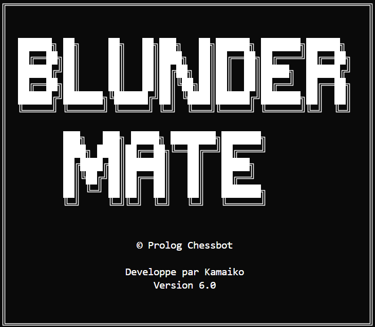

<div align="center">

# BlunderMate

**Chess AI engine built in Prolog.**

Negamax · Alpha-Beta · PSQT · MVV-LVA

[](https://www.swi-prolog.org/)
[]()

<br>


&nbsp;&nbsp;&nbsp;


</div>

---

### Quick Start

```bash
# Requires SWI-Prolog 9.x+
swipl go.pl
```

### Features

- Human vs Human and Human vs AI modes
- Negamax search with Alpha-Beta pruning (depth 2)
- Piece-Square Table evaluation + MVV-LVA move ordering
- Full FIDE rules with check, checkmate & stalemate detection
- 42 automated tests across 7 categories

### Architecture

```
src/pieces.pl       Piece movement rules
src/board.pl        8×8 board representation
src/game.pl         Game state & move validation
src/interface.pl    User interface
src/ai.pl           Negamax + Alpha-Beta search
src/evaluation.pl   Heuristic evaluation (material + PSQT + piece safety)
```

### Documentation

- [Architecture Guide](docs/ARCHITECTURE_GUIDE_DEVELOPERS.md)
- [Technical Report](docs/RAPPORT_TECHNIQUE.md)
- [Product Requirements](docs/PRD.md)

---

<div align="center">

Built with [Claude Code](https://claude.ai/code)

</div>
