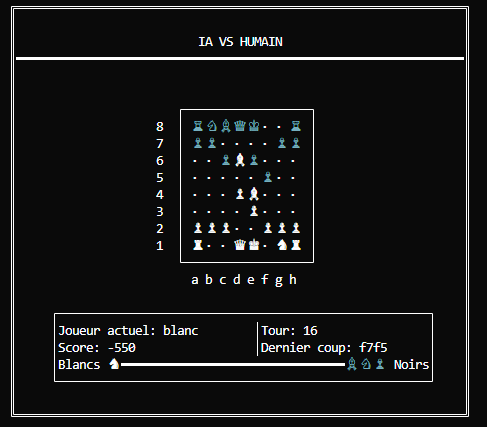

<div align="center">

# BlunderMate

**Chess AI engine built in Prolog.**

Negamax · Alpha-Beta · PSQT · MVV-LVA

[](https://www.swi-prolog.org/)
[]()

<br>



</div>

---

### Quick Start

```bash
# Requires SWI-Prolog 9.x+
swipl go.pl
```

### Game Modes

- **Human vs Human** — Local two-player game
- **Human vs AI** — Play against the engine

### How to Play

Moves use standard algebraic notation — type the origin and destination squares together.

```
e2e4    Move pawn from e2 to e4
g1f3    Move knight from g1 to f3
```

### How It Works

The AI searches possible moves using a Negamax algorithm with Alpha-Beta pruning at depth 2. Each position is scored through material balance, piece-square tables, and piece safety heuristics — allowing the engine to evaluate thousands of positions per move in real time.
