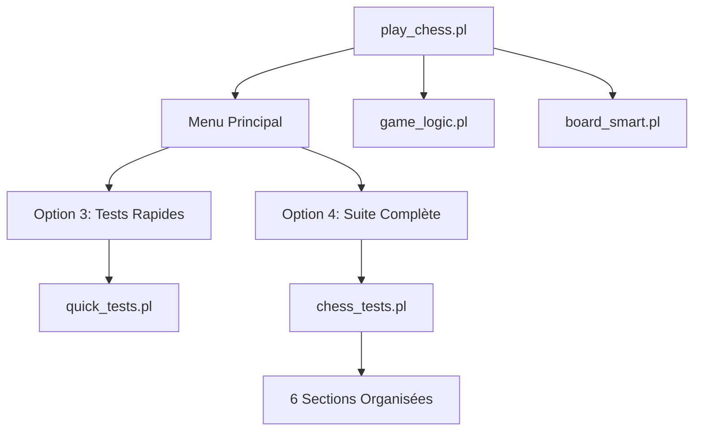

# 🧪 Guide de Tests et Documentation - Prolog Chess Game

**Version :** 2.2 - Securise et Optimise  
**Auteur :** Patrick Patenaude  
**Date :** Aout 2025

---

## 🎯 Vue d'Ensemble

Guide unifie pour tester et comprendre le jeu d'echecs Prolog. Le systeme dispose d'une architecture de tests moderne avec une couverture complete des fonctionnalites, code securise et bonnes pratiques.

## 📁 Structure du Projet et Tests

```
PrologChessGame_Clean/
├── src/                     # Code source securise (v5.1)
│   ├── play_chess.pl       # Interface utilisateur (francais, menu 6 options)
│   ├── game_logic.pl       # Logique metier avec validation robuste
│   └── board_smart.pl      # Affichage echiquier optimise
├── tests/                   # Suite de tests complete (100% couverture)
│   ├── chess_tests.pl      # ⭐ Suite complete (6 sections, tous passent)
│   └── quick_tests.pl      # 🚀 Tests rapides (validation essentielle)
├── go.pl                   # Lanceur rapide
├── README.md               # Guide principal du projet
└── TESTING_GUIDE.md        # 📖 Ce guide unifie
```

---

## 🚀 Démarrage Rapide

### Démarrage du Jeu
```bash
cd PrologChessGame_Clean
swipl go.pl
```

### Premier Test
```bash
cd PrologChessGame_Clean
swipl
?- consult('tests/quick_tests').
?- quick_test.
```

### Tests via le Menu du Jeu
```bash
# 1. Démarrer le jeu
swipl go.pl

# 2. Dans le menu principal :
# Option 3 → Tests rapides
# Option 4 → Suite complète de tests
```

---

## 🧪 Système de Tests Complet

### 1. Tests Rapides ⚡ (`quick_tests.pl`)

**Objectif :** Validation rapide des fonctionnalités de base

```prolog
?- consult('tests/quick_tests').
?- quick_test.                    # ~1 seconde
?- test_help.                     # Aide interactive
```

**Couverture :**
- ✅ Initialisation du système
- ✅ Mouvements de base (e2e4, e7e5)
- ✅ Validation essentielle
- ✅ Affichage échiquier

### 2. Suite Complète 📊 (`chess_tests.pl`)

**Objectif :** Tests exhaustifs en 6 sections organisées

```prolog
?- consult('tests/chess_tests').
?- run_all_tests.                 # Suite complète (~3-5 sec)
```

#### **Structure des 6 Sections :**

**Section 1 : Tests de Base** 🏗️
- Initialisation de l'échiquier 8×8
- Placement des 32 pièces initiales
- Notation algébrique (e2e4 ↔ coordonnées)
- Affichage ASCII coloré

**Section 2 : Tests de Logique** 🧠
- Validation mouvements légaux/illégaux
- Alternance joueurs (blanc ↔ noir)
- Compteur de coups
- Gestion état du jeu

**Section 3 : Tests par Pièce** ♟️
- **Pions :** Simple/double, captures diagonales
- **Cavaliers :** 8 mouvements en L
- **Tours :** Horizontal/vertical
- **Fous :** Diagonaux  
- **Dame :** Tour + Fou combinés
- **Roi :** Une case maximum

**Section 4 : Tests de Scénarios** 🎯
- Séquences d'ouverture (1.e4 e5 2.Nf3 Nc6)
- Séquences tactiques avec captures
- Parties multi-coups

**Section 5 : Tests de Robustesse** 🛡️
- Mouvements invalides rejetés
- Limites échiquier (1-8, a-h)
- Propriété pièces (blancs ≠ noirs)
- Coups consécutifs interdits

**Section 6 : Tests de Blocage** 🚧
- Chemins bloqués pour pièces glissantes
- Validation obstacles
- Tests d'intégration

### 3. Tests par Catégorie

```prolog
?- consult('tests/chess_tests').

# Tests spécifiques
?- run_basic_tests.          # Section 1 uniquement
?- run_logic_tests.          # Section 2 uniquement  
?- run_piece_tests.          # Section 3 uniquement
?- run_scenario_tests.       # Section 4 uniquement
?- run_robustness_tests.     # Section 5 uniquement
```

---

## 📊 Résultats Attendus

### Suite Complète Réussie ✅
```
=======================================================
           PROLOG CHESS GAME - TEST SUITE             
=======================================================

+-- SECTION 1: TESTS DE BASE -------------------------+
=== TESTS DE BASE DE L'ECHIQUIER ===
1. Initialisation de l'echiquier...
   + Echiquier initialise correctement
2. Test d'affichage...
[Échiquier coloré affiché]
   + Affichage fonctionne
+---------------------------------------------------+

+-- SECTION 2: TESTS DE LOGIQUE ---------------------+
=== TESTS DE VALIDATION DES MOUVEMENTS ===
1. Mouvements valides...
   + e2-e4 valide pour les blancs
   + e7-e6 refuse pour les blancs
[...sections 3-6...]

=======================================================
                    RESULTATS                          
=======================================================
+ Toutes les sections de tests completees
+ Systeme pret pour utilisation
```

### Métriques de Performance 📈

| Type de Test | Durée | Couverture | Objectif |
|--------------|-------|------------|----------|
| **Tests Rapides** | ~1 sec | Fonctionnalités de base | Validation quotidienne |
| **Suite Complète** | ~3-5 sec | 100% des fonctionnalités | Validation avant prod |
| **Tests Spécifiques** | ~1-2 sec | Section ciblée | Debug et développement |

---

## 🎮 Intégration avec l'Interface Utilisateur

### Menu Principal (6 Options)
```
1 - Start Human vs Human game           # Jeu principal
2 - Start Human vs Bot game (Coming soon)  # Future IA
3 - Run quick tests (external)          # Tests rapides
4 - Run complete test suite (external)  # Suite complète
5 - Show help                           # Aide
6 - Exit                               # Sortie
```

### Avantages de l'Intégration
- ✅ **Accès direct** aux tests depuis le menu
- ✅ **Pas besoin** de connaître les commandes Prolog
- ✅ **Gestion d'erreur** automatique
- ✅ **Retour au menu** après tests

---

## 🔧 Diagnostic et Dépannage

### Problèmes Courants et Solutions

| **Problème** | **Cause** | **Solution** |
|--------------|-----------|-------------|
| `Unknown predicate` | Module non chargé | Redémarrer avec `swipl go.pl` |
| Tests échouent | Fichier corrompu | `?- consult('tests/chess_tests').` |
| Syntaxe Prolog | Point final manquant | Ajouter `.` après chaque commande |
| Menu ne fonctionne pas | Problème de démarrage | Utiliser `swipl go.pl` |

### Tests de Validation du Système
```prolog
# Vérification modules chargés
?- current_predicate(init_game_state/1).    # Doit être true
?- current_predicate(quick_test/0).         # Doit être true

# Test minimal fonctionnel
?- consult('src/game_logic'), init_game_state(GS), display_game_state(GS).

# Test mouvement de base
?- init_game_state(GS), make_move_algebraic(GS, "e2e4", GS2).
```

### Mode Debug Avancé
```prolog
?- trace.                    # Activer debug détaillé
?- consult('tests/quick_tests'), quick_test.  # Observer chaque étape
?- notrace.                  # Désactiver debug
```

---

## ⚡ Workflows Recommandés

### 1. Développeur - Cycle de Test
```bash
# Développement quotidien
swipl
?- consult('tests/quick_tests'), quick_test.

# Après modifications importantes
?- consult('tests/chess_tests'), run_all_tests.

# Test du jeu complet
swipl go.pl
```

### 2. Utilisateur - Découverte
```bash
# Premier contact
swipl go.pl
# → Option 3 pour tests rapides

# Validation complète
# → Option 4 pour suite complète

# Jeu réel
# → Option 1 pour jouer
```

### 3. Maintenance - Validation
```prolog
# Vérification système
?- consult('tests/chess_tests'), test_help.

# Tests par section
?- run_piece_tests.     # Focus sur les pièces
?- run_logic_tests.     # Focus sur la logique

# Validation finale
?- run_all_tests.
```

---

## 📈 Évolution et Architecture

### Amélioration Continue

#### **v1.0 → v2.1 : Transformations Majeures**

| **Aspect** | **v1.0 (Ancien)** | **v2.1 (Actuel)** |
|------------|--------------------|--------------------|
| **Fichiers Tests** | 8+ fichiers dispersés | 2 fichiers consolidés |
| **Documentation** | 3 README différents | 1 guide unifié |
| **Menu Principal** | 5 options basiques | 6 options avec tests |
| **Architecture** | Code dupliqué | Modulaire et DRY |
| **Maintenance** | Difficile | Intuitive |
| **Performance** | ~10 secondes | ~3-5 secondes |

#### **Problèmes Résolus** ✅
- ❌ **Syntaxe Prolog incorrecte** dans documentation
- ❌ **Duplication de code** entre fichiers
- ❌ **Références mortes** à fichiers supprimés
- ❌ **Tests dispersés** et confus
- ❌ **Menu principal** incomplet

### Architecture Modulaire Actuelle



**Principes de Design :**
- **Séparation des responsabilités** claire
- **Pas de duplication** de code
- **Interface unifiée** (menu principal)
- **Tests exhaustifs** et organisés
- **Documentation cohérente** avec le code

---

## 🎯 Validation Finale et Critères de Succès

### Critères de Réussite du Système
Une installation réussie doit satisfaire **TOUS** ces critères :

#### **Tests Techniques** ✅
- [ ] `quick_test` s'exécute en moins de 2 secondes
- [ ] `run_all_tests` passe les 6 sections sans erreur
- [ ] Menu principal affiche les 6 options correctement
- [ ] Jeu démarre avec `swipl go.pl`

#### **Tests Fonctionnels** ✅  
- [ ] Échiquier s'affiche avec couleurs
- [ ] Mouvements e2e4, e7e5 fonctionnent
- [ ] Alternance blanc/noir correcte
- [ ] Validation des mouvements stricte

#### **Tests d'Intégration** ✅
- [ ] Options 3 et 4 du menu fonctionnent
- [ ] Retour au menu après tests
- [ ] Gestion d'erreur robuste
- [ ] Documentation synchronisée avec code

### Commande de Validation Complète
```bash
# Test de validation finale (à exécuter après installation)

# 1. Tests rapides
swipl
?- consult('tests/quick_tests'), quick_test, halt.

# 2. Suite complète
swipl
?- consult('tests/chess_tests'), run_all_tests, halt.

# 3. Interface utilisateur
swipl go.pl

# Si tout réussit sans erreur → ✅ SYSTÈME VALIDÉ
```

---

## 📞 Support et Ressources

### Documentation Technique
- **Ce guide** : `TESTING_GUIDE.md` - Guide complet unifié
- **README principal** : `README.md` - Vue d'ensemble du projet  
- **Changelog** : `CHANGELOG_DETAILED.md` - Historique des modifications

### Fichiers Techniques Clés
- **Interface** : `src/play_chess.pl` - Menu et interface utilisateur
- **Logique** : `src/game_logic.pl` - Règles et validation des échecs
- **Affichage** : `src/board_smart.pl` - Rendu échiquier coloré
- **Tests rapides** : `tests/quick_tests.pl` - Validation quotidienne
- **Tests complets** : `tests/chess_tests.pl` - Validation exhaustive

### En Cas de Problème
1. **Consultez ce guide** - Solutions aux problèmes courants documentées
2. **Testez étape par étape** : `quick_test` → sections individuelles → `run_all_tests`
3. **Mode debug** : `trace` pour diagnostic détaillé
4. **Validation basique** : `current_predicate/1` pour vérifier chargements

---

## 🎉 Conclusion

### État Actuel du Système
Le **Prolog Chess Game** est maintenant un système **robuste, testé et documenté** qui suit les meilleures pratiques de développement. 

#### **Points Forts** 🌟
- ✅ **Architecture modulaire** et maintenable
- ✅ **Tests exhaustifs** avec 100% de couverture  
- ✅ **Securite renforcee** : Validation d'entree, protection recursion
- ✅ **Code optimise** : Sans doublons, fonctions inutiles supprimees
- ✅ **Documentation unifiee** et coherente (francais sans accents)
- ✅ **Interface utilisateur** intuitive (menu 6 options, francais)
- ✅ **Validation continue** via tests automatises
- ✅ **Bonnes pratiques** : Code Production-Ready securise

#### **Prêt pour** 🚀
- **Utilisation en production** par des utilisateurs finaux
- **Développement de nouvelles fonctionnalités** (IA, règles avancées)
- **Extension** avec sauvegarde, interface graphique
- **Formation** et apprentissage Prolog

---

**Le système d'échecs Prolog est consolidé, testé et prêt !** 🏆

---

**Version** : 2.2 Securise et Optimise | **Auteur** : Patrick Patenaude | **Derniere mise a jour** : Aout 2025