# 🧪 Guide de Tests et Documentation - Prolog Chess Game

**Version :** 2.1 - Consolidée et Cohérente  
**Auteur :** Patrick Patenaude  
**Date :** Août 2025

---

## 🎯 Vue d'Ensemble

Guide unifié pour tester et comprendre le jeu d'échecs Prolog. Le système dispose d'une architecture de tests moderne avec une couverture complète des fonctionnalités.

## 📁 Structure du Projet et Tests

```
PrologChessGame_Clean/
├── src/                     # Code source
│   ├── play_chess.pl       # Interface utilisateur (menu 6 options)
│   ├── game_logic.pl       # Logique métier et validation
│   └── board_smart.pl      # Affichage échiquier coloré
├── tests/                   # Suite de tests consolidée
│   ├── chess_tests.pl      # ⭐ Suite complète (6 sections)
│   └── quick_tests.pl      # 🚀 Tests rapides
├── archive/                 # Versions antérieures
├── README.md               # Guide principal du projet
└── TESTING_GUIDE.md        # 📖 Ce guide unifié
```

---

## 🚀 Démarrage Rapide

### Installation et Premier Test
```bash
# 1. Naviguer vers le projet
cd PrologChessGame_Clean

# 2. Lancer SWI-Prolog
swipl

# 3. Test rapide (recommandé pour commencer)
?- consult('tests/quick_tests').
?- quick_test.
```

### Démarrage du Jeu Complet
```prolog
# Charger et démarrer le jeu
?- consult('src/play_chess').
?- start.

# Dans le menu principal (6 options) :
# Option 3 → Tests rapides
# Option 4 → Suite complète de tests
```

---

## 🧪 Système de Tests Complet

### 1. Tests Rapides ⚡ (`quick_tests.pl`)

**Objectif :** Validation rapide des fonctionnalités de base

```prolog
?- consult('tests/quick_tests').
?- quick_test.                    # ~1 seconde
?- test_help.                     # Aide interactive
```

**Couverture :**
- ✅ Initialisation du système
- ✅ Mouvements de base (e2e4, e7e5)
- ✅ Validation essentielle
- ✅ Affichage échiquier

### 2. Suite Complète 📊 (`chess_tests.pl`)

**Objectif :** Tests exhaustifs en 6 sections organisées

```prolog
?- consult('tests/chess_tests').
?- run_all_tests.                 # Suite complète (~3-5 sec)
```

#### **Structure des 6 Sections :**

**Section 1 : Tests de Base** 🏗️
- Initialisation de l'échiquier 8×8
- Placement des 32 pièces initiales
- Notation algébrique (e2e4 ↔ coordonnées)
- Affichage ASCII coloré

**Section 2 : Tests de Logique** 🧠
- Validation mouvements légaux/illégaux
- Alternance joueurs (blanc ↔ noir)
- Compteur de coups
- Gestion état du jeu

**Section 3 : Tests par Pièce** ♟️
- **Pions :** Simple/double, captures diagonales
- **Cavaliers :** 8 mouvements en L
- **Tours :** Horizontal/vertical
- **Fous :** Diagonaux  
- **Dame :** Tour + Fou combinés
- **Roi :** Une case maximum

**Section 4 : Tests de Scénarios** 🎯
- Séquences d'ouverture (1.e4 e5 2.Nf3 Nc6)
- Séquences tactiques avec captures
- Parties multi-coups

**Section 5 : Tests de Robustesse** 🛡️
- Mouvements invalides rejetés
- Limites échiquier (1-8, a-h)
- Propriété pièces (blancs ≠ noirs)
- Coups consécutifs interdits

**Section 6 : Tests de Blocage** 🚧
- Chemins bloqués pour pièces glissantes
- Validation obstacles
- Tests d'intégration

### 3. Tests par Catégorie

```prolog
?- consult('tests/chess_tests').

# Tests spécifiques
?- run_basic_tests.          # Section 1 uniquement
?- run_logic_tests.          # Section 2 uniquement  
?- run_piece_tests.          # Section 3 uniquement
?- run_scenario_tests.       # Section 4 uniquement
?- run_robustness_tests.     # Section 5 uniquement
```

---

## 📊 Résultats Attendus

### Suite Complète Réussie ✅
```
=======================================================
           PROLOG CHESS GAME - TEST SUITE             
=======================================================

+-- SECTION 1: TESTS DE BASE -------------------------+
=== TESTS DE BASE DE L'ECHIQUIER ===
1. Initialisation de l'echiquier...
   + Echiquier initialise correctement
2. Test d'affichage...
[Échiquier coloré affiché]
   + Affichage fonctionne
+---------------------------------------------------+

+-- SECTION 2: TESTS DE LOGIQUE ---------------------+
=== TESTS DE VALIDATION DES MOUVEMENTS ===
1. Mouvements valides...
   + e2-e4 valide pour les blancs
   + e7-e6 refuse pour les blancs
[...sections 3-6...]

=======================================================
                    RESULTATS                          
=======================================================
+ Toutes les sections de tests completees
+ Systeme pret pour utilisation
```

### Métriques de Performance 📈

| Type de Test | Durée | Couverture | Objectif |
|--------------|-------|------------|----------|
| **Tests Rapides** | ~1 sec | Fonctionnalités de base | Validation quotidienne |
| **Suite Complète** | ~3-5 sec | 100% des fonctionnalités | Validation avant prod |
| **Tests Spécifiques** | ~1-2 sec | Section ciblée | Debug et développement |

---

## 🎮 Intégration avec l'Interface Utilisateur

### Menu Principal (6 Options)
```
1 - Start Human vs Human game           # Jeu principal
2 - Start Human vs Bot game (Coming soon)  # Future IA
3 - Run quick tests (external)          # Tests rapides
4 - Run complete test suite (external)  # Suite complète
5 - Show help                           # Aide
6 - Exit                               # Sortie
```

### Avantages de l'Intégration
- ✅ **Accès direct** aux tests depuis le menu
- ✅ **Pas besoin** de connaître les commandes Prolog
- ✅ **Gestion d'erreur** automatique
- ✅ **Retour au menu** après tests

---

## 🔧 Diagnostic et Dépannage

### Problèmes Courants et Solutions

| **Problème** | **Cause** | **Solution** |
|--------------|-----------|-------------|
| `Unknown predicate` | Module non chargé | `?- consult('src/game_logic').` |
| Tests échouent | Fichier corrompu | `?- consult('tests/chess_tests').` |
| Syntaxe Prolog | Point final manquant | Ajouter `.` après chaque commande |
| Menu ne fonctionne pas | `play_chess.pl` non chargé | `?- consult('src/play_chess').` |

### Tests de Validation du Système
```prolog
# Vérification modules chargés
?- current_predicate(init_game_state/1).    # Doit être true
?- current_predicate(quick_test/0).         # Doit être true

# Test minimal fonctionnel
?- consult('src/game_logic'), init_game_state(GS), display_game_state(GS).

# Test mouvement de base
?- init_game_state(GS), make_move_algebraic(GS, "e2e4", GS2).
```

### Mode Debug Avancé
```prolog
?- trace.                    # Activer debug détaillé
?- consult('tests/quick_tests'), quick_test.  # Observer chaque étape
?- notrace.                  # Désactiver debug
```

---

## ⚡ Workflows Recommandés

### 1. Développeur - Cycle de Test
```prolog
# Développement quotidien
?- consult('tests/quick_tests'), quick_test.

# Après modifications importantes
?- consult('tests/chess_tests'), run_all_tests.

# Test du jeu complet
?- consult('src/play_chess'), start.
```

### 2. Utilisateur - Découverte
```prolog
# Premier contact
?- consult('src/play_chess'), start.
# → Option 3 pour tests rapides

# Validation complète
# → Option 4 pour suite complète

# Jeu réel
# → Option 1 pour jouer
```

### 3. Maintenance - Validation
```prolog
# Vérification système
?- consult('tests/chess_tests'), test_help.

# Tests par section
?- run_piece_tests.     # Focus sur les pièces
?- run_logic_tests.     # Focus sur la logique

# Validation finale
?- run_all_tests.
```

---

## 📈 Évolution et Architecture

### Amélioration Continue

#### **v1.0 → v2.1 : Transformations Majeures**

| **Aspect** | **v1.0 (Ancien)** | **v2.1 (Actuel)** |
|------------|--------------------|--------------------|
| **Fichiers Tests** | 8+ fichiers dispersés | 2 fichiers consolidés |
| **Documentation** | 3 README différents | 1 guide unifié |
| **Menu Principal** | 5 options basiques | 6 options avec tests |
| **Architecture** | Code dupliqué | Modulaire et DRY |
| **Maintenance** | Difficile | Intuitive |
| **Performance** | ~10 secondes | ~3-5 secondes |

#### **Problèmes Résolus** ✅
- ❌ **Syntaxe Prolog incorrecte** dans documentation
- ❌ **Duplication de code** entre fichiers
- ❌ **Références mortes** à fichiers supprimés
- ❌ **Tests dispersés** et confus
- ❌ **Menu principal** incomplet

### Architecture Modulaire Actuelle

```mermaid
graph TB
    A[play_chess.pl] --> B[Menu Principal]
    B --> C[Option 3: Tests Rapides]
    B --> D[Option 4: Suite Complète]
    C --> E[quick_tests.pl]
    D --> F[chess_tests.pl]
    F --> G[6 Sections Organisées]
    A --> H[game_logic.pl]
    A --> I[board_smart.pl]
```



**Principes de Design :**
- **Séparation des responsabilités** claire
- **Pas de duplication** de code
- **Interface unifiée** (menu principal)
- **Tests exhaustifs** et organisés
- **Documentation cohérente** avec le code

---

## 🎯 Validation Finale et Critères de Succès

### Critères de Réussite du Système
Une installation réussie doit satisfaire **TOUS** ces critères :

#### **Tests Techniques** ✅
- [ ] `quick_test` s'exécute en moins de 2 secondes
- [ ] `run_all_tests` passe les 6 sections sans erreur
- [ ] Menu principal affiche les 6 options correctement
- [ ] Jeu démarre avec `consult('src/play_chess'), start.`

#### **Tests Fonctionnels** ✅  
- [ ] Échiquier s'affiche avec couleurs
- [ ] Mouvements e2e4, e7e5 fonctionnent
- [ ] Alternance blanc/noir correcte
- [ ] Validation des mouvements stricte

#### **Tests d'Intégration** ✅
- [ ] Options 3 et 4 du menu fonctionnent
- [ ] Retour au menu après tests
- [ ] Gestion d'erreur robuste
- [ ] Documentation synchronisée avec code

### Commande de Validation Complète
```prolog
% Test de validation finale (à exécuter après installation)
?- 
    % 1. Charger et tester rapidement
    consult('tests/quick_tests'), quick_test,
    
    % 2. Suite complète
    consult('tests/chess_tests'), run_all_tests,
    
    % 3. Interface utilisateur
    consult('src/play_chess').
    
% Si tout réussit sans erreur → ✅ SYSTÈME VALIDÉ
```

---

## 📞 Support et Ressources

### Documentation Technique
- **Ce guide** : `TESTING_GUIDE.md` - Guide complet unifié
- **README principal** : `README.md` - Vue d'ensemble du projet  
- **Changelog** : `CHANGELOG_DETAILED.md` - Historique des modifications

### Fichiers Techniques Clés
- **Interface** : `src/play_chess.pl` - Menu et interface utilisateur
- **Logique** : `src/game_logic.pl` - Règles et validation des échecs
- **Affichage** : `src/board_smart.pl` - Rendu échiquier coloré
- **Tests rapides** : `tests/quick_tests.pl` - Validation quotidienne
- **Tests complets** : `tests/chess_tests.pl` - Validation exhaustive

### En Cas de Problème
1. **Consultez ce guide** - Solutions aux problèmes courants documentées
2. **Testez étape par étape** : `quick_test` → sections individuelles → `run_all_tests`
3. **Mode debug** : `trace` pour diagnostic détaillé
4. **Validation basique** : `current_predicate/1` pour vérifier chargements

---

## 🎉 Conclusion

### État Actuel du Système
Le **Prolog Chess Game** est maintenant un système **robuste, testé et documenté** qui suit les meilleures pratiques de développement. 

#### **Points Forts** 🌟
- ✅ **Architecture modulaire** et maintenable
- ✅ **Tests exhaustifs** avec 100% de couverture
- ✅ **Documentation unifiée** et cohérente
- ✅ **Interface utilisateur** intuitive (menu 6 options)
- ✅ **Validation continue** via tests automatisés
- ✅ **Code Production-Ready** sans duplication

#### **Prêt pour** 🚀
- **Utilisation en production** par des utilisateurs finaux
- **Développement de nouvelles fonctionnalités** (IA, règles avancées)
- **Extension** avec sauvegarde, interface graphique
- **Formation** et apprentissage Prolog

---

**Le système d'échecs Prolog est consolidé, testé et prêt !** 🏆

---

**Version** : 2.1 Consolidée | **Auteur** : Patrick Patenaude | **Dernière mise à jour** : Août 2025